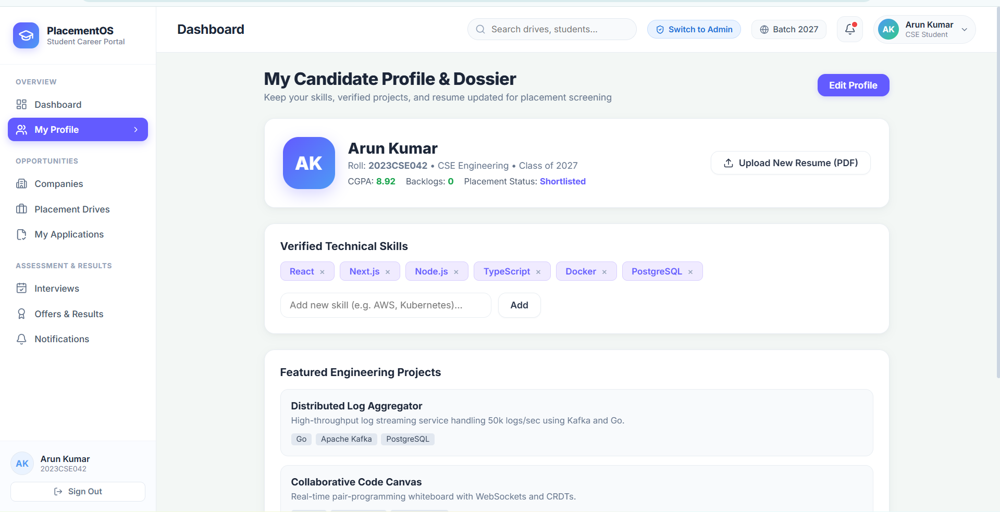

# Campus Placement Management System

A modern and responsive **Campus Placement Management System** built with Next.js, React, and TypeScript. The platform provides dedicated Admin and Student portals for managing placement drives, companies, applications, interviews, offers, notifications, and placement analytics.

## 🚀 Live Demo

[Open Campus Placement Management System](https://campus-placement-management-system-lake.vercel.app/)


## 📌 Project Overview

The Campus Placement Management System is a modern web-based frontend designed to simplify and digitize the campus recruitment workflow between students, placement administrators, and recruiting companies.

The interface follows a clean enterprise SaaS design with colorful analytics cards, interactive tables, charts, responsive layouts, smooth animations, and glowing hover effects.

## ✨ Features

### Admin Portal

- Admin Dashboard
- Placement Analytics
- Company Management
- Placement Drive Management
- Application Tracking
- Interview Scheduling & Evaluations
- Student Management
- Placement Records
- Announcements
- Notifications
- Reports
- Platform Settings

### Student Portal

- Student Dashboard
- Student Profile
- Company Opportunities
- Placement Drives
- My Applications
- Interview Schedules
- Offers & Results
- Notifications

### UI & Experience

- Modern SaaS dashboard design
- Responsive layout
- Light theme interface
- Color-coded statistics and status indicators
- Interactive charts and analytics
- Search and filtering interfaces
- Modal dialogs
- Smooth page animations
- Glow-on-hover card effects
- Cinematic application entry animation
- Mobile-friendly design

## 🛠️ Tech Stack

- **Next.js**
- **React**
- **TypeScript**
- **CSS**
- **Recharts**
- **Lucide React**
- **Vercel**

## 🏗️ Project Structure

```text
Campus-Placement-Management-System/
│
├── app/
│   ├── admin/
│   ├── student/
│   ├── globals.css
│   ├── layout.tsx
│   └── page.tsx
│
├── components/
│   └── ...
│
├── lib/
│   └── mockData.ts
│
├── public/
│   └── campus-entry.mp4
│
├── types/
│   ├── announcement.ts
│   ├── application.ts
│   ├── common.ts
│   ├── company.ts
│   ├── drive.ts
│   ├── interview.ts
│   ├── placement.ts
│   └── student.ts
│
├── screenshots/
│   └── dashboard.png
│
├── next.config.ts
├── package.json
├── package-lock.json
├── tsconfig.json
└── README.md

<h2>📸 Screenshots</h2>

<h3>🔐 Admin Dashboard</h3>

<p align="center">
  
</p>


</td>
</tr>
</table>
